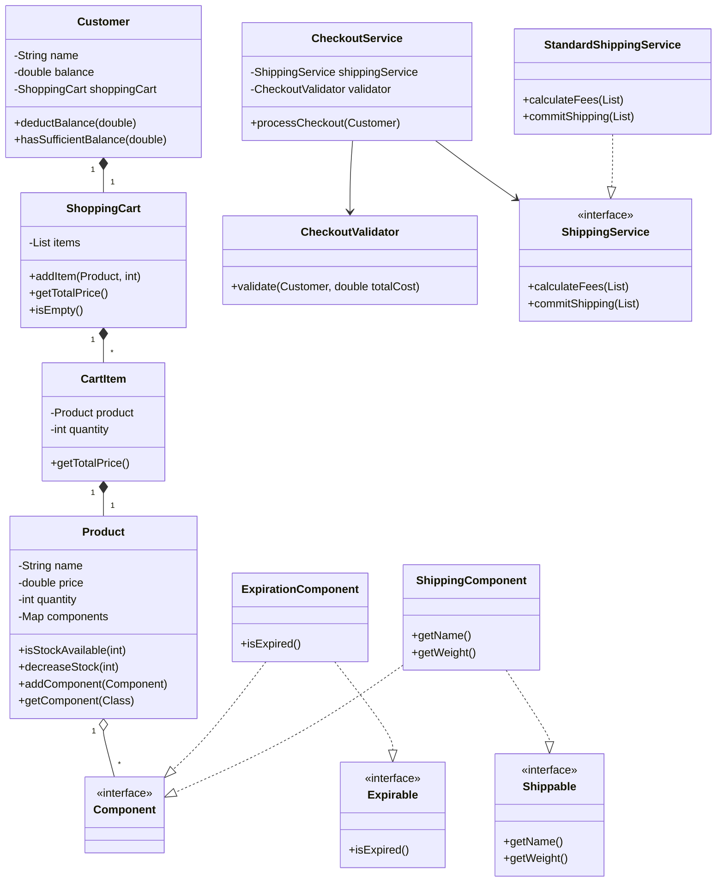

# Fawry Ecommerce Challenge

## 📝 Table of Contents
* Description
* Features
* Prerequisites
* Installation and Run
* Project Structure
* UML Diagram
* Code Snippets with Output
* License
  
## 📄 Description
This project is a solution for the Fawry Full Stack Development Internship Quantum Challenge. It simulates basic e-commerce functionalities, including product management, shopping cart operations, and a checkout process.

## 🔧 Prerequisites
- Java 21

## ✨ Features
- Define products with names, prices, and quantities.
- Create products that can expire.
- Create shippable products that have a weight.
- Checkout items from the cart and print a detailed receipt.
- Handle errors like empty carts, insufficient funds, or out-of-stock products.

## ⚙️ Installation and Run
1. **Clone the repository:**
   ```sh
   git clone https://github.com/Abdulrahman295/Fawry-Ecommerce-Challenge.git
   cd Fawry-Ecommerce-Challenge
   ```

2. **Compile the source code:**
   Create a directory to store the compiled classes:
   ```sh
   mkdir out
   ```
   Compile all Java source files and place the output in the `out` directory:
   ```sh
   javac -d out src/main/java/com/fawry/ecommerce/*/*.java src/main/java/com/fawry/ecommerce/*/*/*.java src/main/java/com/fawry/ecommerce/Main.java
   ```

3. **Run the application:**
   Execute the `main` method from the `out` directory:
   ```sh
   java -cp out main.java.com.fawry.ecommerce.Main
   ```

## 🌳 Project Structure
The project follows a standard Java project structure:
```
Fawry-Ecommerce-Challenge/
└── src/
    └── main/
        └── java/
            └── com/
                └── fawry/
                    └── ecommerce/
                        ├── component/  // Contains components that can be attached to products to add behaviors (e.g., expiration, shipping).
                        ├── enums/      // Contains enumerations used in the project (e.g., ProductType).
                        ├── model/      // Contains the core data models for the application (e.g., Product, Customer, ShoppingCart).
                        ├── service/    // Contains the business logic and services (e.g., CheckoutService, ShippingService).
                        └── Main.java   // The main entry point of the application.
```

## 📊 UML Diagram
Here is a UML class diagram that illustrates the design of the system:



## 💻 Code Snippets with Output
### 1. Successful Checkout (Shippable & Expirable Products)
**Code**
```java
ShippingService shippingService = new StandardShippingService();
CheckoutValidator checkoutValidator = new CheckoutValidator();
CheckoutService checkoutService = new CheckoutService(shippingService, checkoutValidator);

Customer customer = new Customer("Jane Doe", 500.0);

Product cheese = new Product("Cheese", 100, 10, ProductType.CHEESE);
cheese.addComponent(new ExpirationComponent(LocalDate.now().plusDays(7)));
cheese.addComponent(new ShippingComponent(cheese.getName(), 0.2));

Product biscuits = new Product("Biscuits", 150, 10, ProductType.BISCUITS);
biscuits.addComponent(new ExpirationComponent(LocalDate.now().plusDays(5)));
biscuits.addComponent(new ShippingComponent(biscuits.getName(), 0.7));

customer.addToCart(cheese, 2);
customer.addToCart(biscuits, 1);
checkoutService.processCheckout(customer);
```
**Output**
```console
** Shipment notice **
2x Cheese            400g
1x Biscuits          700g
Total package weight 1.1kg

Shipment submitted successfully!

** Checkout Receipt **
2 x Cheese               $200.00
1 x Biscuits             $150.00
---------------------------------
Subtotal:              $350.00
Shipping Cost:         $ 34.70
Paid Amount:           $384.70
New Customer Balance:  $115.30
```

### 2. Checkout with a Regular Product (Non-Shippable, Non-Expirable)
**Code**
```java
ShippingService shippingService = new StandardShippingService();
CheckoutValidator checkoutValidator = new CheckoutValidator();
CheckoutService checkoutService = new CheckoutService(shippingService, checkoutValidator);

Customer customer = new Customer("John Smith", 100.0);
Product scratchCard = new Product("Scratch Card", 50, 5, ProductType.SCRATCH_CARD);

customer.addToCart(scratchCard, 1);
checkoutService.processCheckout(customer);
```
**Output**
```console
No items to ship.

** Checkout Receipt **
1 x Scratch Card         $ 50.00
---------------------------------
Subtotal:              $ 50.00
No shipping fees applied.
Paid Amount:           $ 50.00
New Customer Balance:  $ 50.00
```

### 3. Error: Empty Cart
**Code**
```java
ShippingService shippingService = new StandardShippingService();
CheckoutValidator checkoutValidator = new CheckoutValidator();
CheckoutService checkoutService = new CheckoutService(shippingService, checkoutValidator);

Customer customer = new Customer("Jane Doe", 500.0);
// No items are added to the cart
checkoutService.processCheckout(customer);
```
**Output**
```console
Checkout failed: Shopping cart is empty. Please add items to your cart before checking out.
```

### 4. Error: Insufficient User Balance
**Code**
```java
ShippingService shippingService = new StandardShippingService();
CheckoutValidator checkoutValidator = new CheckoutValidator();
CheckoutService checkoutService = new CheckoutService(shippingService, checkoutValidator);

// Customer only has $50
Customer customer = new Customer("Jane Doe", 50.0);

Product tv = new Product("TV", 300, 1, ProductType.TV);
tv.addComponent(new ShippingComponent(tv.getName(), 5.0)); // Shippable product

customer.addToCart(tv, 1);
checkoutService.processCheckout(customer);
```
**Output**
```console
Checkout failed: Insufficient balance. Required: 440.0, Available: 50.0
```

### 5. Error: Product Out of Stock
**Code**
```java
Customer customer = new Customer("Jane Doe", 500.0);
// Only 2 biscuits are in stock
Product biscuits = new Product("Biscuits", 150, 2, ProductType.BISCUITS);

// Customer tries to add 3
customer.addToCart(biscuits, 3);
```
**Output**
```console
Checkout failed: Insufficient stock for product: Biscuits
```

### 6. Error: Expired Product
**Code**
```java
ShippingService shippingService = new StandardShippingService();
CheckoutValidator checkoutValidator = new CheckoutValidator();
CheckoutService checkoutService = new CheckoutService(shippingService, checkoutValidator);

Customer customer = new Customer("Jane Doe", 500.0);
Product cheese = new Product("Cheese", 20, 10, ProductType.CHEESE);

// Expiration date is set to yesterday
cheese.addComponent(new ExpirationComponent(LocalDate.now().minusDays(1)));

customer.addToCart(cheese, 1);
checkoutService.processCheckout(customer);
```
**Output**
```console
Checkout failed: Product is expired: Cheese
```

## 📰 License
This project is licensed under the MIT License. See the `LICENSE` file for more details.
